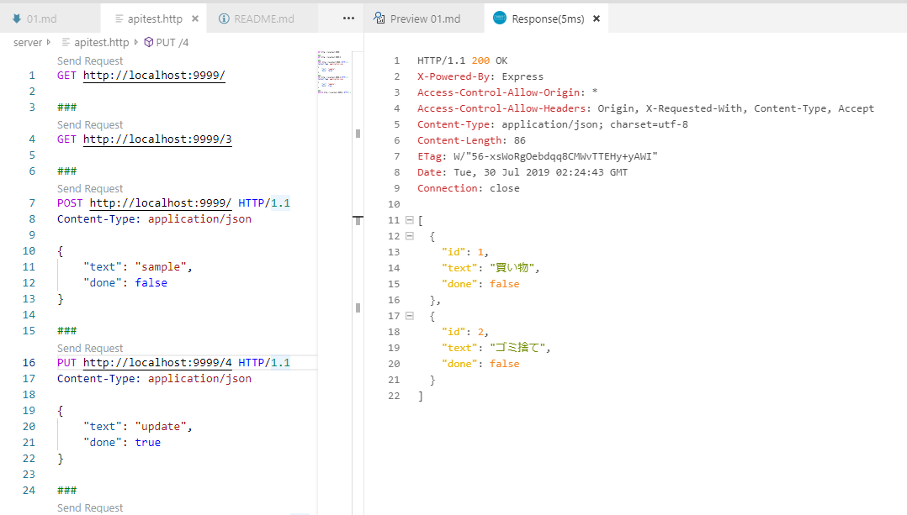

# Vue.js TODO リストハンズオン 1

ここでは、ハンズオンで使用する API サーバーの起動を確認します。

## API サーバーの起動

API サーバーのプログラムは TypeScript で書かれた単純な GET/POST/PUT/DELETE に対応する TODO を返す API です。

1. リポジトリ直下の server フォルダーにターミナルで移動します。
1. `npm run build` を実行して API サーバーのプログラムをビルドします。
1. `npm run start` を実行して API サーバーのプログラムを実行します。
1. 以下のような結果が表示されればサーバーは動いています。
   ```
   $ npm run start
   > todo-server@1.0.0 start /server
   > node ./dist/index.js
   
   listening http://localhost:9999/
   ```
1. `server/apitest.http` を Visual Studio Code で開いて `Send Request` をクリックして各種 API の動きを確認します。
   
1. `Ctrl + C` で API サーバーを停止します

## 定義されている API

- `GET http://localhost:9999/`

  TODO のリストの配列を返します。
- `GET http://localhost:9999/:id`

  `:id` で指定した ID の TODO を返します。
- `POST http://localhost:9999/`

  Body の内容で新しい TODO を作成します。
- `PUT http://localhost:9999/:id`

  `:id` で指定した ID の TODO を Body の内容で更新します。
- `DELETE http://localhost:9999/:id`

  `:id` で指定した ID の TODO を削除します。

TODO は以下のような JSON になります。

```json
{
    "id": 1,
    "text": "買い物",
    "done": false
}
```

[次へ: Vue のプロジェクトを作成](./02.md)