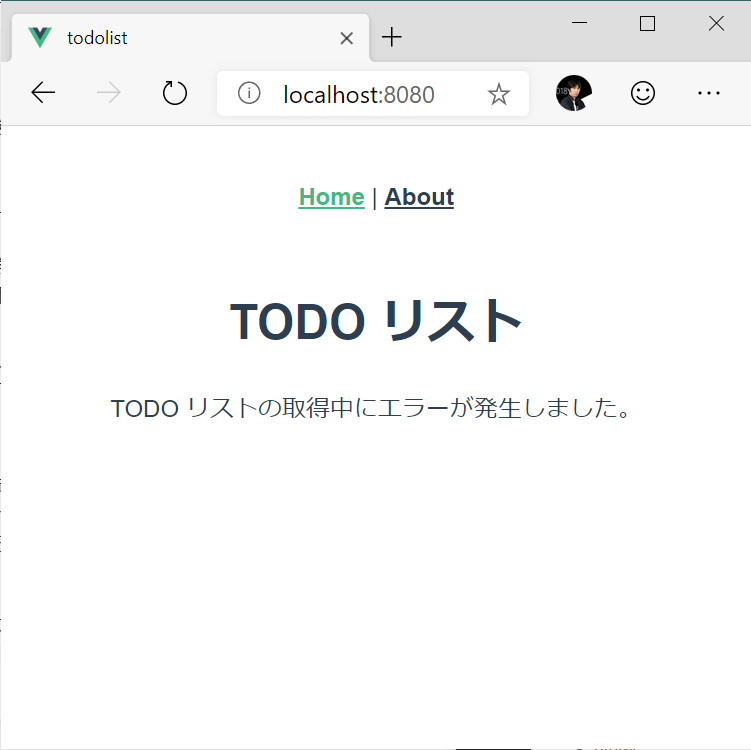

# Vue.js TODO リストハンズオン 3

ここでは、ハンズオン 2 で作成したローカルの TODO を表示するものを実際に API を叩いて取得した結果を表示するように変更します。

## API サーバーの起動

1. ターミナルで `server` フォルダーに移動して、以下のコマンドを実行します。
   ```
   $ npm run build
   $ npm run start
   ```
2. ターミナルに `listening http://localhost:9999/` と表示されていることを確認します。

## API 呼び出し処理を作成

1. todolist アプリのフォルダーで以下のコマンドを実行して axios をインストールします。
   ```
   $ npm install --save axios
   ```
1. `src/services/TodoService.ts` を開いて API を呼び出すように編集します。
   ```typescript
   import TodoItem from '@/models/TodoItem';
   import axiosBase from 'axios';
   
   const axios = axiosBase.create({
       baseURL: 'http://localhost:9999',
       headers: {
           'Content-Type': 'application/json',
       },
       responseType: 'json',
   });
   
   class TodoService {
       async getAll(): Promise<TodoItem[]> {
           const response = await axios.get('/');
           return response.data as TodoItem[];
       }
   }
   
   export default new TodoService();
   ```
1. `npm run serve` を実行して（既に実行済みの方は、ファイルを保存するだけで大丈夫です）`http://localhost:8080` にアクセスします。以下のように API サーバーから取得したデータが表示されます。

   

1. ネットワークを経由した通信が発生するので `src/components/TosoList.vue` に以下のように例外処理を追加します。
   ```html
   <template>
     <div id="todo-list">
       <h1>TODO リスト</h1>
       <p v-if="errorMessage">{{ errorMessage }}</p>
       <ol>
         <li v-for="todo in todos" v-bind:key="todo.id">
           <input type="checkbox" :checked="todo.done" disabled="disabled" />
           {{ todo.text }}
         </li>
       </ol>
     </div>
   </template>
   
   <script lang="ts">
   import Vue from "vue";
   import TodoItem from "@/models/TodoItem";
   import todoService from "@/services/TodoService";
   
   declare interface TodoListData {
     todos: TodoItem[];
     errorMessage: string;
   }
   
   export default Vue.extend({
     data() {
       return {
         errorMessage: "",
         todos: []
       } as TodoListData;
     },
     async created() {
       try {
         this.todos = await todoService.getAll();
       } catch {
         this.errorMessage = "TODO リストの取得中にエラーが発生しました。";
       }
     }
   });
   </script>
   
   <style>
   li {
     list-style-type: none;
   }
   </style>
   ```

   API サーバーを停止した状態で `http://localhost:8080` を表示すると以下のようにエラーメッセージが表示されます。

   

[次へ: 新しい TODO の追加](./04.md)