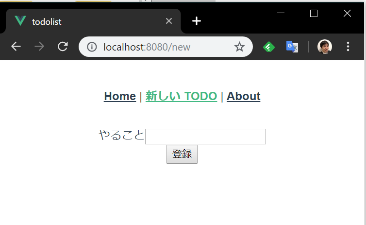

# Vue.js TODO リストハンズオン 4

ここでは、新しい TODO の追加処理を実装します。

## TODO 追加処理をサービスに追加

1. `src/services/TodoService.ts` を開いて `TodoService` クラスに以下の `add` メソッドを追加します。
    このメソッドの戻り値は、新規追加された TodoItem の id になります。
    ```typescript
    async add(todoItem: TodoItem): Promise<number> {
        const response = await axios.post('/', todoItem);
        return (<TodoItem>response.data).id;
    }
    ```

## TODO 追加ページの作成

1. `src/views/NewTodo.vue` を作成して以下のように編集します。
    ```html
    <template>
      <form @submit.prevent="submitNewTodo">
        <div v-if="errors.length">
          <h3>入力内容にエラーがあります</h3>
          <ul>
            <li v-for="error in errors" v-bind:key="error">{{ error }}</li>
          </ul>
        </div>
        <div>
          <label>やること</label>
          <input type="text" v-model="text" />
        </div>
        <div>
          <input type="submit" value="登録" />
        </div>
      </form>
    </template>
    
    <script lang="ts">
    import Vue from "vue";
    import todoService from "@/services/TodoService";
    
    declare interface NewTodoData {
      errors: string[];
      text: string;
    }
    export default Vue.extend({
      data() {
        return {
          errors: [],
          text: ""
        } as NewTodoData;
      },
      methods: {
        async submitNewTodo() {
          this.errors = [];
          if (!this.text) {
            this.errors.push("やることを入力してください");
            return;
          }
    
          await todoService.add({
            id: 0,
            text: this.text,
            done: false
          });
    
          this.$router.push({ name: "home" });
        }
      }
    });
    </script>
    
    <style>
    ul {
      list-style-type: none;
    }
    </style>
    ```
1. `src/router.ts` に `NewTodo` へのルートの定義を `/new` というパスで追加します。
    ```typescript
    import Vue from 'vue'
    import Router from 'vue-router'
    import Home from './views/Home.vue'
    import NewTodo from '@/views/NewTodo.vue'; // import 追加
    
    Vue.use(Router);
    
    export default new Router({
      mode: 'history',
      base: process.env.BASE_URL,
      routes: [
        {
          path: '/',
          name: 'home',
          component: Home
        },
        // 定義の追加
        {
          path: '/new',
          name: 'new',
          component: NewTodo,
        },
        {
          path: '/about',
          name: 'about',
          // route level code-splitting
          // this generates a separate chunk (about.[hash].js) for this route
          // which is lazy-loaded when the route is visited.
          component: () => import(/* webpackChunkName: "about" */ './views/About.vue')
        }
      ]
    })
    ```
1. `src/App.vue` の `template` タグに `/new` へのナビゲーションリンクを追加します。
    ```html
    <template>
      <div id="app">
        <div id="nav">
          <router-link to="/">Home</router-link> |
          <router-link to="/new">新しい TODO</router-link> |
          <router-link to="/about">About</router-link>
        </div>
        <router-view/>
      </div>
    </template>
    ```
1. 実行すると、ページ上部に「新しい TODO」のリンクが追加されます。
    
1. 「新しい TODO」リンクをクリックすると画面遷移して `NewTodo.vue` で定義したページが表示されます。
    
1. 未入力でボタンを押したときに入力エラーのメッセージが出たり、やることを入力したときに登録ボタンを押すと新しい TODO が追加されます。

[次へ: TODO の編集機能の追加](./05.md)